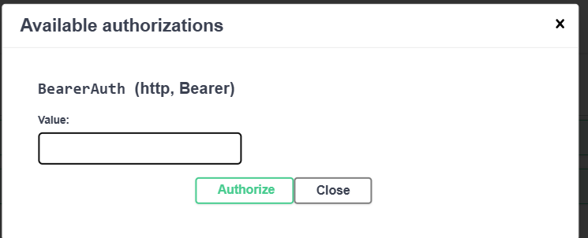

# API Specification
**Swagger** https://server.injoo.kz/docs

1. Go to the Swagger.  
2. Вызовите `POST /auth/login` с тестовыми данными:
```json
{
  "phone": "test",
  "password": "test"
}
```
3. Copy the `access_token` from the response.  
4. Click the **Authorize** button in Swagger and paste the token into the field:
    Bearer <access_token>



**Base URL:** `http://server.injoo.kz`

---

## Auth

### POST /auth/register

**Purpose:** Регистрация нового пользователя
**Request Body:**

```json
{
  "phone": "string",
  "full_name": "string (optional)",
  "password": "string"
}
```

**Response 200:**

```json
{
  "access_token": "jwt_token_here",
  "token_type": "bearer",
  "user_role": "customer"
}
```

**Error Codes:**

* 422: Validation Error

---

### POST /auth/login

**Purpose:** Вход пользователя
**Query Parameters:**

* `phone` (string, required)
* `password` (string, required)

**Response 200:**

```json
{
  "access_token": "jwt_token_here",
  "token_type": "bearer",
  "user_role": "customer"
}
```

**Error Codes:**

* 422: Validation Error

---

## Menu

### GET /menu/

**Purpose:** Список блюд
**Response 200:** Array of dishes

```json
[
  {
    "id": 1,
    "name": "Dish Name",
    "description": "Description",
    "price": 100,
    "category": "Category",
    "images": [
      { "id": 1, "image_url": "url" }
    ]
  }
]
```

### POST /menu/

**Purpose:** Создать новое блюдо
**Request Body (multipart/form-data):**

```json
{
  "name": "string",
  "description": "string",
  "price": 100,
  "category": "string",
  "images": ["file1", "file2"]
}
```

**Response 200:** Created Dish Object

### GET /menu/{dish_id}

**Purpose:** Получить блюдо по ID
**Path Parameter:** `dish_id` (integer)
**Response 200:** Dish Object

### PUT /menu/{dish_id}

**Purpose:** Обновить блюдо
**Path Parameter:** `dish_id` (integer)
**Request Body:** как POST /menu/
**Response 200:** Updated Dish Object

### DELETE /menu/{dish_id}

**Purpose:** Удалить блюдо
**Path Parameter:** `dish_id` (integer)
**Response 200:** Deleted Dish Object

### GET /menu/category/{category_name}

**Purpose:** Получить блюда по категории
**Path Parameter:** `category_name` (string)
**Response 200:** Array of Dish Objects

---

## Orders

### POST /orders/

**Purpose:** Создать заказ
**Request Body:**

```json
{
  "address_id": 1,
  "kaspi_number": "string",
  "dishes": [
    { "dish_id": 1, "quantity": 2 }
  ]
}
```

**Response 200:** Order Object

### GET /orders/my

**Purpose:** Получить заказы текущего пользователя
**Response 200:** Array of Order Objects

### POST /orders/table

**Purpose:** Создать заказ на стол
**Request Body:**

```json
{
  "table_id": 1,
  "dishes": [
    { "dish_id": 1, "quantity": 2 }
  ]
}
```

**Response 200:** Order Object

---

## Addresses

### GET /addresses/

**Purpose:** Получить адреса пользователя
**Response 200:** Array of Address Objects

### POST /addresses/

**Purpose:** Добавить новый адрес
**Request Body:**

```json
{
  "address": "string",
  "apartment": "string (optional)",
  "entrance": "string (optional)",
  "floor": "string (optional)"
}
```

**Response 200:** Address Object

### DELETE /addresses/{address_id}

**Purpose:** Удалить адрес
**Path Parameter:** `address_id` (integer)
**Response 200:** Deleted Address Object
