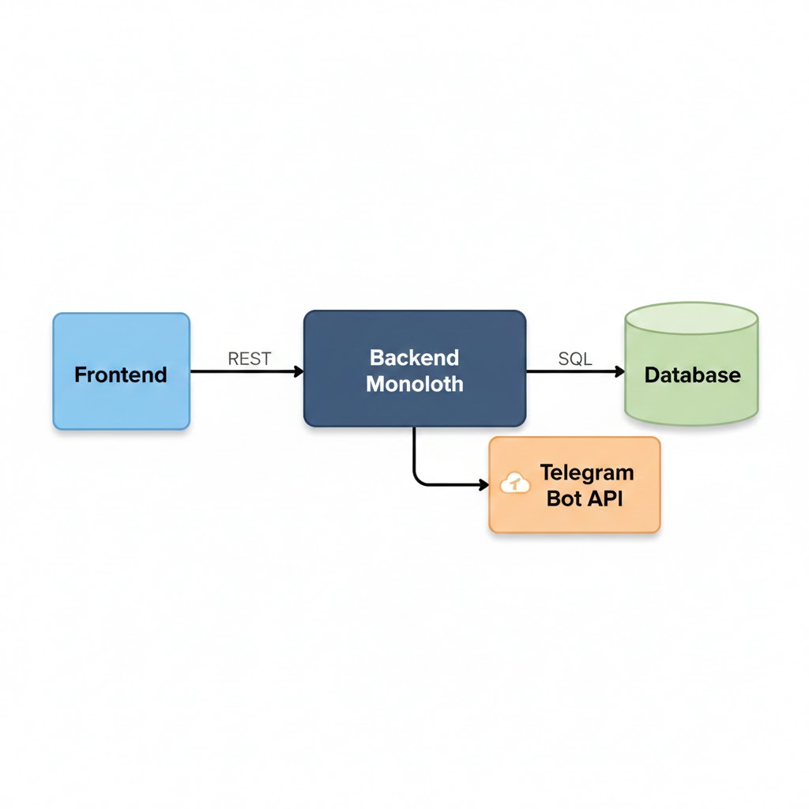
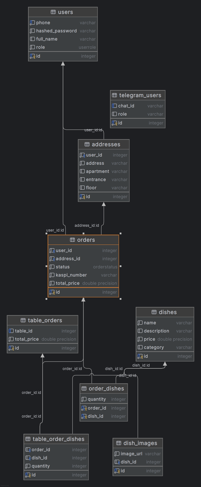

# System Architecture

## 1. Architecture Style
**Chosen architecture style:** Monolithic Architecture  
**Reason for this choice:**  
- All application logic (frontend, backend, database interactions) is in a single deployable unit  
- Simplifies development and deployment for MVP  
- Easier to maintain and test initially compared to microservices  
- Can be refactored into microservices later if needed  

---

## 2. System Components
Short description of each component:

- **Front end:**  
  - Built with Vue.js (Vite) and Tailwind CSS  
  - Provides user interface for customers, couriers, kitchen staff, and admins  
  - Communicates with backend via REST API  

- **Back end:**  
  - FastAPI-based monolithic application in Python  
  - Handles authentication, business logic, order workflows, and admin management  
  - Sends notifications via Telegram bot  

- **Database:**  
  - PostgreSQL for production
  - Stores users, dishes, orders, and order statuses  

- **External services:**  
  - **Telegram Bot API:** Sends order notifications to kitchen and courier   
  - **Nginx:** Reverse proxy and request routing  

---

## 3. Component Diagram
**Short description:**  
- Frontend sends requests to backend API  
- Backend handles all business logic and interacts with the database  
- External services (Telegram) are called when needed  
- Responses are returned to frontend for user display  

---

## 4. Data Flow
1. **User action:** Customer places an order through the frontend.  
2. **Request processing:** Frontend sends POST request to backend API.  
3. **Backend logic:** Monolithic backend validates data, creates order, assigns status `pending`.  
4. **Database storage:** Order details are stored in PostgreSQL.  
5. **Notification:** Telegram bot notifies kitchen staff of the new order.  
6. **Order updates:** Kitchen and courier update status via API.  
7. **Response:** Backend sends updated order status to frontend, displayed to customer.  

---

## 5. Database Schema

---

## 6. Technology Decisions
- **FastAPI:** Single backend app, handles all logic efficiently  
- **Vue.js + Vite:** Lightweight frontend, easy integration with REST API  
- **PostgreSQL:** Relational database, reliable for monolithic app  
- **Docker & Docker Compose:** Consistent local and production environments  
- **Telegram Bot API:** Real-time order notifications  
- **Cloudinary:** Handles media storage outside the monolith  

---

## 7. Future Extensions
- Refactor parts of the monolith into microservices for scaling  
- Add online payment integration  
- Implement multi-restaurant support  
- Develop mobile applications (iOS / Android)  
- Add analytics and reporting for admins  
- Introduce caching layer for high-traffic endpoints  
