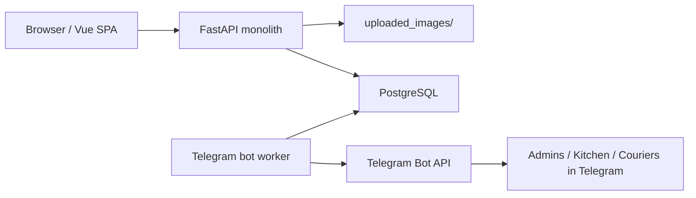
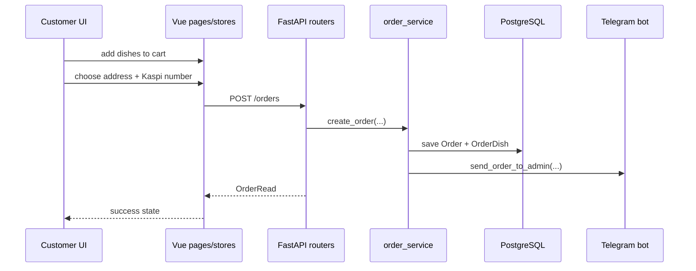
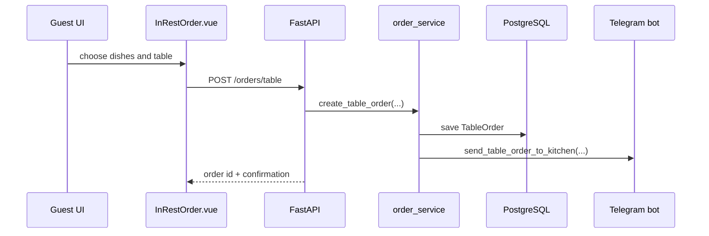
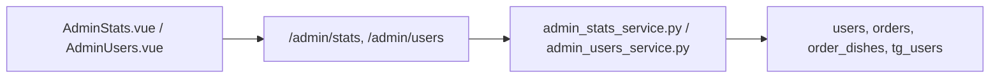

# Architecture Map

## 1. Current System Shape

INJOO is a monolithic food-ordering platform with three runtime parts:

- `frontend/` — Vue 3 + Vite client for customer, guest, and admin flows
- `backend/` — FastAPI application with SQLAlchemy models, Pydantic schemas, and business services
- `backend/telegram_bot/` — operational Telegram workflow for admins, kitchen, and couriers

Deployment is described in `docker-compose.yml`:

- `injoo-frontend` serves the SPA
- `injoo-app` runs FastAPI
- `injoo-bot` runs Telegram polling as a separate process
- `injoo-migrate` runs schema bootstrap before app startup
- `db` is PostgreSQL
- `nginx-proxy` and `letsencrypt` handle public ingress and TLS

## 2. Runtime Map



## 3. Repository Map

```text
backend/
  app/
    main.py               -> thin FastAPI entrypoint
    factory.py            -> app factory and middleware/static/OpenAPI setup
    api.py                -> router registration
    bootstrap.py          -> database bootstrap entrypoint logic
    database.py           -> engine, session factory, Base
    deps.py               -> auth and role guards
    schema_bootstrap.py   -> ad-hoc schema patching at startup
    models/               -> SQLAlchemy entities
    schemas/              -> request/response DTOs
    routers/              -> HTTP endpoints
    services/             -> business logic
    utils/security.py     -> password hashing and JWT
  telegram_bot/
    main.py               -> Telegram polling entrypoint
    bot_instance.py       -> bot and dispatcher initialization
    handlers.py           -> Telegram registration and order lifecycle
    notifier.py           -> outbound Telegram notifications from backend services

frontend/
  src/
    main.js               -> Vue bootstrap + Pinia + Router
    router/index.js       -> route tree and role entry points
    components/           -> shared UI and menu shell
    stores/               -> cart, address, UI helpers
    pages/
      MainPage/           -> landing and marketing pages
      Auth/               -> login and registration
      Customer/           -> customer delivery flow
      Admin/              -> admin dashboard pages

docs/
  API.md                  -> HTTP contract
  Architecture.md         -> this document
```

## 4. Backend Module Map

### 4.1 Composition Root

`backend/app/main.py` wires the application together:

- delegates to `create_app()` from `backend/app/factory.py`
- mounts `/uploaded_images`
- registers routers: `/auth`, `/menu`, `/orders`, `/addresses`, `/admin/*`

Telegram polling now runs in a separate worker process via `backend/telegram_bot/main.py`.

### 4.2 Infrastructure Layer

- `backend/app/database.py` contains SQLAlchemy engine/session setup
- `backend/app/deps.py` contains `get_db`, `get_current_user`, `admin_required`
- `backend/app/utils/security.py` owns password hashing and JWT creation/validation
- `backend/app/schema_bootstrap.py` applies manual schema adjustments outside Alembic
- `backend/app/bootstrap_cli.py` runs the bootstrap explicitly, outside web app import time

### 4.3 Domain Models

Core database entities live in `backend/app/models/`:

- `user.py`
  - `User`
  - `UserRole`: `admin`, `staff`, `customer`
  - `UserStatus`: `active`, `blocked`
- `address.py`
  - `Address`
  - delivery address belongs to one user
- `dish.py`
  - `Dish`
  - availability and category are stored here
- `dish_image.py`
  - image records attached to dishes
- `order.py`
  - `Order` and `OrderDish` for delivery orders
  - `TableOrder` and `TableOrderDish` for in-hall guest orders
  - `OrderStatus`: `pending`, `accepted`, `ready`, `done`
- `tguser.py`
  - Telegram-side operational users for bot roles

### 4.4 API Layer

Routers are thin controllers in `backend/app/routers/`:

- `auth.py`
  - registration
  - login
  - Kazakhstan phone validation
  - blocked-user check
- `menu.py`
  - dish CRUD
  - category filter
  - availability toggle
- `order.py`
  - create delivery order
  - list current user orders
  - create table order
- `address.py`
  - add/list/delete delivery addresses
- `admin_stats.py`
  - aggregated admin dashboard metrics
- `admin_users.py`
  - paginated user management and user detail view
- `sitemap.py`
  - SEO/support endpoint

### 4.5 Service Layer

Business logic is concentrated in `backend/app/services/`:

- `dish_service.py`
  - dish CRUD
  - image persistence
  - availability updates
- `address_service.py`
  - user-scoped address management
- `order_service.py`
  - order creation
  - price calculation
  - order item materialization
  - Telegram notifications
  - table-order flow
- `admin_stats_service.py`
  - revenue aggregates
  - top dishes
  - status counters
- `admin_users_service.py`
  - user list filters
  - pagination
  - user details
  - block/unblock
  - role updates

### 4.6 Telegram Workflow Layer

`backend/telegram_bot/handlers.py` is a separate operational module tightly coupled to orders:

- sends new delivery orders to Telegram admins for confirmation
- forwards confirmed orders to kitchen
- handles "ready" and "done" lifecycle transitions
- supports guest table orders for kitchen without delivery address
- manages Telegram-side registration codes for bot roles

Architecturally, this is not an external microservice. It is an in-process extension of the backend.

## 5. Frontend Module Map

### 5.1 App Shell

- `frontend/src/main.js` bootstraps Vue, Pinia, router, Leaflet CSS, Cropper CSS
- `frontend/src/App.vue` is the root container
- `frontend/src/router/index.js` is the central route graph
- `frontend/src/components/SideBar.vue` is the main shell for authenticated areas

### 5.2 Shared UI Modules

- `frontend/src/components/MenuInterface.vue`
  - main catalog UI
  - category filters
  - menu fetch
  - add-to-cart logic
  - admin-side edit/delete/toggle availability actions
- `frontend/src/components/CustomModal.vue`
  - modal wrapper reused in several flows
- `frontend/src/components/Loader.vue`
  - loading state component
- `frontend/src/components/Footer.vue`
  - site footer

`MenuInterface.vue` is currently a high-impact shared module because it mixes customer browsing and part of admin dish management in one component.

### 5.3 State Modules

- `frontend/src/stores/Basket.js`
  - cart items
  - add/remove
  - computed totals
- `frontend/src/stores/addressStore.js`
  - selected delivery address state
- `frontend/src/stores/useAutoClose.js`
  - small UI helper/composable

### 5.4 Page Modules

`frontend/src/pages/` is grouped by business area:

- `MainPage/`
  - public landing content
  - map/address entry UI pieces
- `Auth/`
  - `Login.vue`
  - `Register.vue`
- `Customer/`
  - `Main.vue` — customer shell with address and menu
  - `Basket.vue` — checkout and order creation
  - `MyOrder.vue` — order history and statuses
  - `InRestOrder.vue` — guest in-hall ordering
- `Admin/`
  - `AdminStats.vue`
  - `AdminUsers.vue`
  - `AddDishes.vue`

## 6. Cross-Module Responsibility Map

| Business area | Frontend modules | Backend routers | Backend services | Data model |
|---|---|---|---|---|
| Authentication | `pages/Auth/*` | `routers/auth.py` | `utils/security.py` + auth logic in router | `User` |
| Menu/catalog | `components/MenuInterface.vue`, `pages/Admin/AddDishes.vue` | `routers/menu.py` | `dish_service.py` | `Dish`, `DishImage` |
| Addresses | `pages/Customer/Main.vue`, `pages/Customer/Basket.vue`, `stores/addressStore.js` | `routers/address.py` | `address_service.py` | `Address` |
| Delivery orders | `pages/Customer/Basket.vue`, `pages/Customer/MyOrder.vue`, `stores/Basket.js` | `routers/order.py` | `order_service.py` | `Order`, `OrderDish` |
| Guest hall orders | `pages/Customer/InRestOrder.vue` | `routers/order.py` (`/orders/table`) | `order_service.py` | `TableOrder`, `TableOrderDish` |
| Admin stats | `pages/Admin/AdminStats.vue` | `routers/admin_stats.py` | `admin_stats_service.py` | `Order`, `User`, `TelegramUser` |
| Admin users | `pages/Admin/AdminUsers.vue` | `routers/admin_users.py` | `admin_users_service.py` | `User`, `Order` |
| Telegram ops | none in SPA | started from `main.py` | `telegram_bot/handlers.py` | `Order`, `TelegramUser`, `Address`, `Dish` |

## 7. Main Flows

### 7.1 Customer Delivery Order



### 7.2 Guest In-Hall Order



### 7.3 Admin Analytics and Users



## 8. Data Relationships

At the data level, the project revolves around these relationships:

- one `User` has many `Address`
- one `User` has many `Order`
- one `Address` can be reused by many `Order`
- one `Order` has many `OrderDish`
- one `Dish` participates in many `OrderDish`
- guest hall flow uses a parallel branch: `TableOrder` -> `TableOrderDish`
- Telegram operations use `TelegramUser`, not the main `User`

This split between `User` and `TelegramUser` is important: customer accounts and operational bot accounts are separate subsystems sharing order context but not identity storage.

## 9. Current Architectural Characteristics

### Strengths

- clear monolith split into `routers -> services -> models/schemas`
- frontend pages are grouped by business area
- Telegram workflow is integrated into the same order lifecycle, so business flow stays centralized
- admin analytics and user management are isolated into separate backend services

### Important Constraints

- schema evolution is still bootstrap-based through `bootstrap_cli.py` and `schema_bootstrap.py`, not yet full Alembic migrations
- Telegram polling is now separated into `injoo-bot`, but bot callbacks are still implemented in one large `handlers.py`
- `MenuInterface.vue` is a large shared component with mixed responsibilities
- route structure in `frontend/src/router/index.js` still contains absolute child paths under `/customer`, so URL layout is functional but structurally brittle

## 10. Recommended Mental Model For Working In This Repo

When changing the project, it is safest to navigate it like this:

1. Start from the page in `frontend/src/pages/` that triggers the behavior.
2. Check shared state in `frontend/src/stores/` if the UI spans multiple pages.
3. Find the corresponding HTTP router in `backend/app/routers/`.
4. Move into the matching service in `backend/app/services/`.
5. Validate which SQLAlchemy entities and Pydantic schemas participate.
6. If the feature touches order statuses, also inspect `backend/telegram_bot/handlers.py`.

That path matches the real dependency flow of the codebase and helps avoid missing cross-module side effects.
